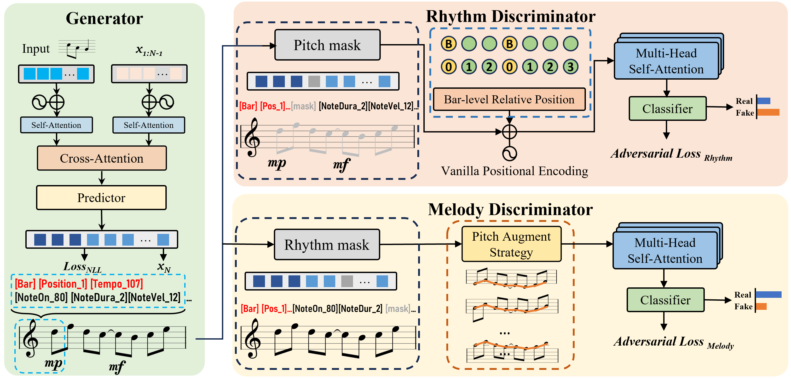

## Fine-grained Discriminators for Symbolic Music Generation

[ICPR2024] Official implementation of paper "Generating High-Quality Symbolic Music Using Fine-Grained Discriminators"



### Abstract
Existing symbolic music generation methods usually utilize discriminator to improve the quality of generated music via global perception of music. However, considering the complexity of information in music, such as rhythm and melody, a single discriminator cannot fully reflect the differences in these two primary dimensions of music. In this work, we propose to decouple the melody and rhythm from music, and design corresponding fine-grained discriminators to tackle the aforementioned issues. Specifically, equipped with a pitch augmentation strategy, the melody discriminator discerns the melody variations presented by the generated samples. By contrast, the rhythm discriminator, enhanced with bar-level relative positional encoding, focuses on the velocity of generated notes. Such a design allows the generator to be more explicitly aware of which aspects should be adjusted in the generated music, making it easier to mimic human-composed music. Experimental results on the POP909 benchmark demonstrate the favorable performance of the proposed method compared to several state-of-the-art methods in terms
of both objective and subjective metrics. More demos are available at https://zzdoog.github.io/fg-discriminators/.

The README will be updated soon.

The demos and some generated samples are available at [page](https://zzdoog.github.io/fine-grained-music-discriminators/)


## 🗒 TODOs

- [x] Release the demo at [here](https://zzdoog.github.io/fine-grained-music-discriminators/).

- [x] Release the source code and preprocessed data.

- [x] Update README.md (How to use).

## 📊 Dataset

- [POP909](https://github.com/music-x-lab/POP909-Dataset)(Details about data preprocess see in [here](https://github.com/atosystem/ThemeTransformer)).

## ❀ Environmrnt:
* Clone this Repo 

    ```bash
    git clone https://github.com/ZZDoog/fine-grained-music-discriminators.git -b main --single-branch
    ```

* using python version 3.8.5
* install python dependencies: 

    `pip install -r requirements.txt`

## 🔧 Training:

### Training generator using fine-grained discriminators

`python train_multi_discriminator.py`

### Inference using Theme files in test set

`python --model_path PATH_TO_YOUR_TRAINED_CHECKPOINT --output_name YOUR_INFERENCE_NAME`

The generated symbolic music file (*.mid) will save in ./output/YOUR_INFERENCE_NAME/

### Notice
- Remember to chage the exp_name when you run another round training.
- Every training's checkpoints, logs, and important scripts will be saved in ckpts/you_exp_name.


## 📕 Details of the files in this repo
```
.
├── ckpts                   For saving checkpoints while training
├── data_pkl                Stores train and val data
├── discriminator.py        Melody(Pitch) and Rhythm discriminators code.
├── inference.py            For generating music. (Detailed usage are written in the file)
├── logger.py               For logging
├── mymodel.py              The overal Generator Architecture
├── myTransformer.py        Our transformer revision code 
├── parse_arg.py            Some arguments for training
├── preprocess              For data preprocessing  
│   ├── music_data.py       Dataset definition
│   └── vocab.py            Our vocabulary for transformer
├── randomness.py           For fixing random seed
├── readme.txt              Readme
├── tempo_dict.json         The original tempo information from POP909 (used in inference time)
├── theme_files/            The themes from our testing set.
├── trained_model           The model we trained.
├── train_generator.py      Code for training generator.
├── train_pitch/
│   rhythm_discriminator.py
│                           Code for training the discriminators.
└──train_multi_discriminator.py
                            Code for training the generator with both fine-grained discriminators.
```


## 🙏 Acknowledgments
We would like to thank the authors of previous related projects for generously sharing their code and insights: [Theme Transformer](https://github.com/atosystem/ThemeTransformer), [MuseGAN](https://github.com/salu133445/musegan).


## ✍ Citation
If you find this work helpful and use our code in your research, please kindly cite our paper:
```
@article{zhang2024generating,
  title={Generating High-quality Symbolic Music Using Fine-grained Discriminators},
  author={Zhang, Zhedong and Li, Liang and Zhang, Jiehua and Hu, Zhenghui and Wang, Hongkui and Yan, Chenggang and Yang, Jian and Qi, Yuankai},
  journal={arXiv preprint arXiv:2408.01696},
  year={2024}
}
```