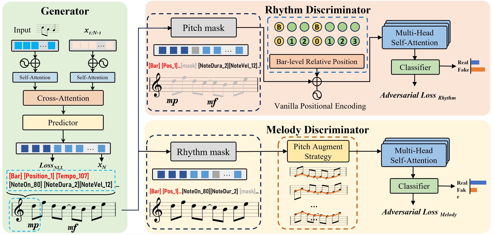

## Fine-grained Discriminators for Symbolic Music Generation

[ICPR2024] Official implementation of paper "Generating High-Quality Symbolic Music Using Fine-Grained Discriminators"

### Abstract
Existing symbolic music generation methods usually utilize discriminator to improve the quality of generated music via global perception of music. However, considering the complexity of information in music, such as rhythm and melody, a single discriminator cannot fully reflect the differences in these two primary dimensions of music. In this work, we propose to decouple the melody and rhythm from music, and design corresponding fine-grained discriminators to tackle the aforementioned issues. Specifically, equipped with a pitch augmentation strategy, the melody discriminator discerns the melody variations presented by the generated samples. By contrast, the rhythm discriminator, enhanced with bar-level relative positional encoding, focuses on the velocity of generated notes. Such a design allows the generator to be more explicitly aware of which aspects should be adjusted in the generated music, making it easier to mimic human-composed music. Experimental results on the POP909 benchmark demonstrate the favorable performance of the proposed method compared to several state-of-the-art methods in terms
of both objective and subjective metrics. More demos are available at https://zzdoog.github.io/fg-discriminators/.

The README will be updated soon.

The demos and some generated samples are available at [page](https://zzdoog.github.io/fine-grained-music-discriminators/)

## 🗒 TODOs

- [x] Release the demo at [here](https://zzdoog.github.io/fine-grained-music-discriminators/).

- [x] Release the source code and preprocessed data.

- [ ] Update README.md (How to use).

## 📊 Dataset

- [POP909](https://github.com/music-x-lab/POP909-Dataset)

## 🙏 Acknowledgments
We would like to thank the authors of previous related projects for generously sharing their code and insights: [Theme Transformer](https://github.com/atosystem/ThemeTransformer), [MuseGAN](https://github.com/salu133445/musegan).
